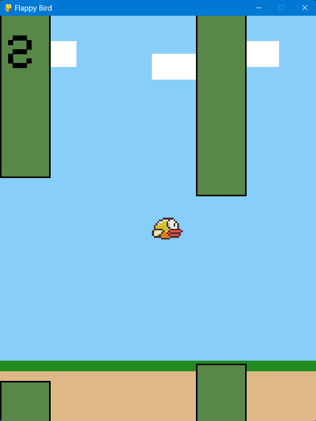

# Flappy-Bird-Pygame
A Python implementation of the classic **Flappy Bird** game, built using **Pygame**. This project features an interactive **opening screen**, **sound effects**, and a **game over screen** with a restart option for an engaging and polished experience.

---

## Features

- **Opening Screen**  
  Start the game with a visually appealing opening screen featuring a clickable "START" button and animations.

- **Game Mechanics**  
  Navigate the bird through pipes by pressing the spacebar to jump while avoiding collisions. The difficulty increases as you progress.

- **Sound Effects**  
  Includes background music, jump sound, collision sound, and scoring sound effects for an immersive gameplay experience.

- **Game Over and Restart**  
  Displays a game over screen when the bird collides with a pipe, with an option to restart the game by pressing the spacebar.

---

## Screenshots

1. **Opening Screen**  
   

2. **In-Game**  
   

3. **Game Over Screen**  
   

---

## How to Play

1. **Download the Game**  
   Clone the repository or download the code and all the required assets from the GitHub repository.

2. **Set Up Assets**  
   Ensure that all assets (e.g., images, sounds) are in the same folder as the `main.py` file.

3. **Run the Game**  
   Run the `main.py` file in Python 3.x:  
   ```bash
   python3 main.py

  ## Controls

- **Spacebar**: Makes the bird jump.
- **After Game Over**: Press **Spacebar** to restart the game.

---

## Dependencies

To run this game, make sure you have the following installed:

- **Python 3.x**
- **Pygame**

### Install Dependencies

To install the required dependencies, use pip:

```bash
pip install pygame

